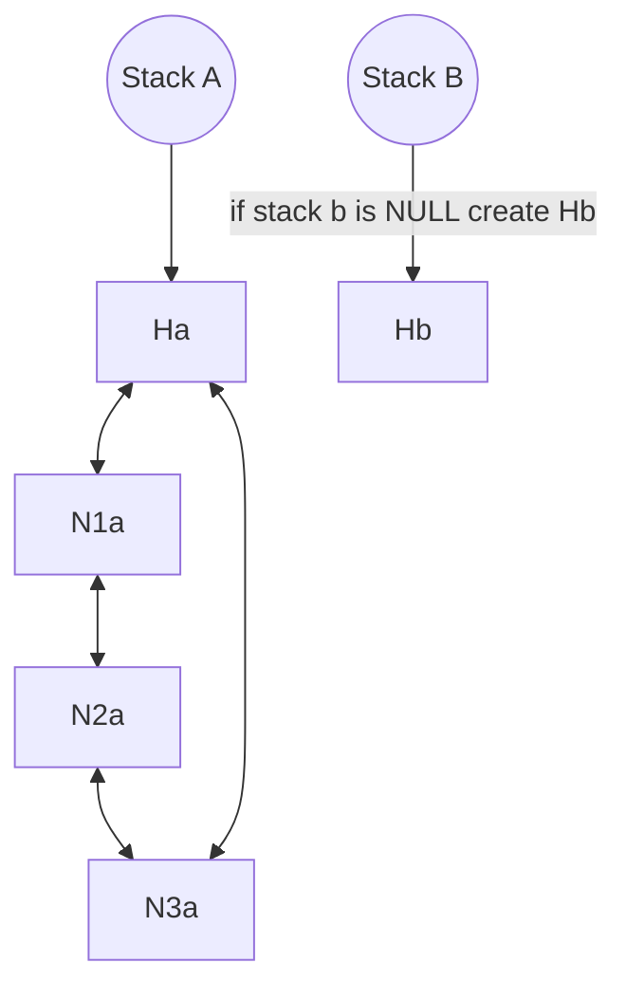
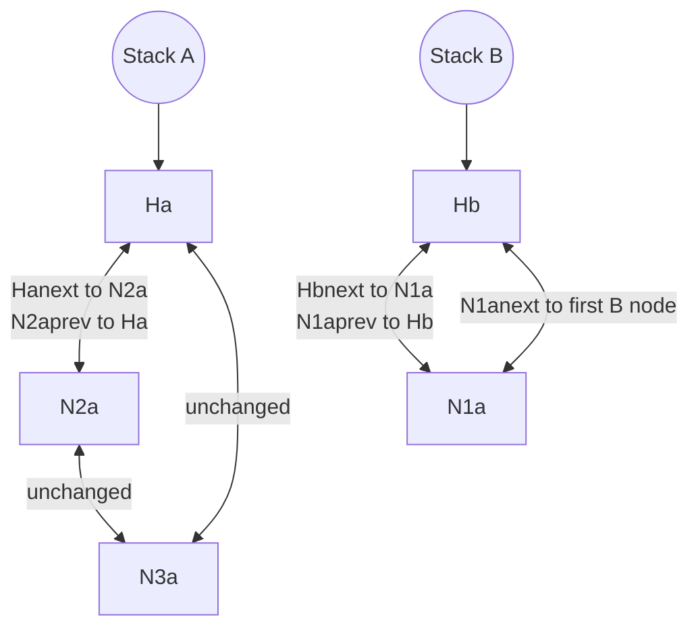

```mermaid
graph TD;
  A((Stack A))-->Ha;
  Ha<-->N1a;
  N1a<-->N2a;
  N2a<-->N3a;
  N3a<-->Ha;
  
  B((Stack B))-->|if stack b is NULL create Hb|Hb;
```

```mermaid
graph TD;
  A((Stack A))-->Ha;
  Ha<-->|Hanext to N2a\nN2aprev to Ha|N2a;
  N2a<-->|unchanged|N3a;
  N3a<-->|unchanged|Ha;
  
  B((Stack B))-->Hb;
  Hb<-->|Hbnext to N1a\nN1aprev to Hb|N1a;
  N1a<-->|N1anext to first B node|Hb;
```
Note: if stack_b has any other nodes N1anext must point to its first node.
