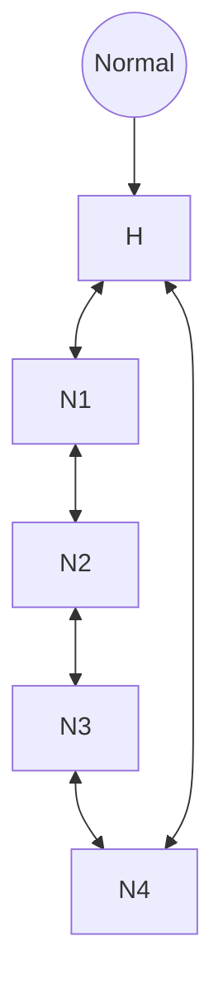
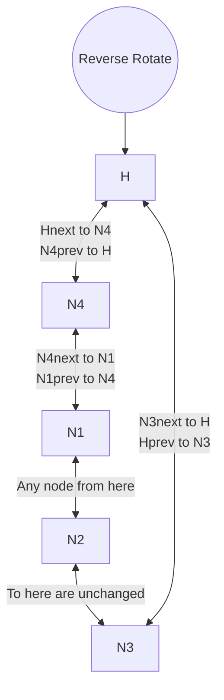

```mermaid
graph TD;
A((Normal))-->H
H<-->N1;
N1<-->N2
N2<-->N3
N3<-->N4;
N4<-->H;
```

```mermaid
graph TD;
A((Reverse Rotate))-->H
H<-->|Hnext to N4\nN4prev to H|N4;
N4<-->|N4next to N1\nN1prev to N4|N1
N1<-->|Any node from here|N2
N2<-->|To here are unchanged|N3
N3<-->|N3next to H\nHprev to N3|H;
```
