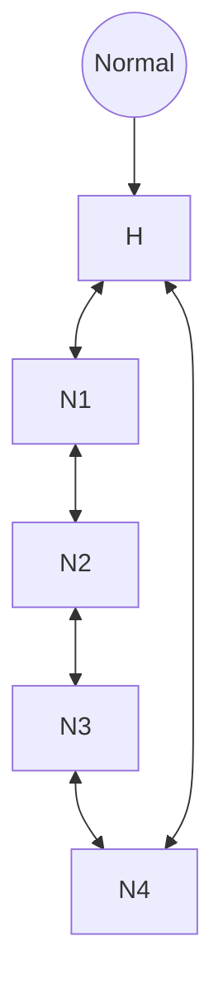
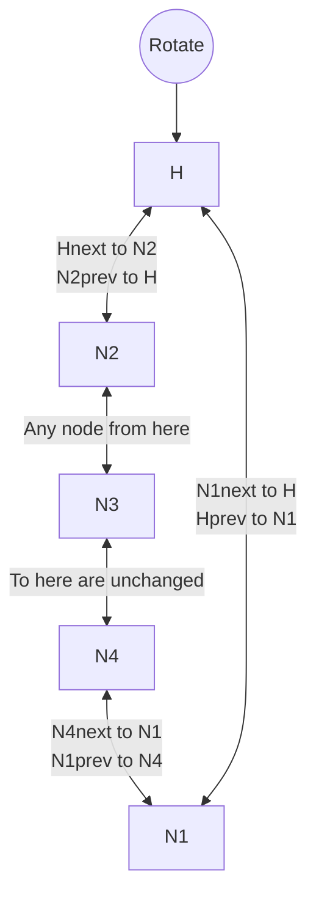

```mermaid
graph TD;
A((Normal))-->H
H<-->N1;
N1<-->N2
N2<-->N3
N3<-->N4;
N4<-->H;
```

```mermaid
graph TD;
A((Rotate))-->H
H<-->|Hnext to N2\nN2prev to H|N2;
N2<-->|Any node from here|N3
N3<-->|To here are unchanged|N4
N4<-->|N4next to N1\nN1prev to N4|N1
N1<-->|N1next to H\nHprev to N1|H;
```
