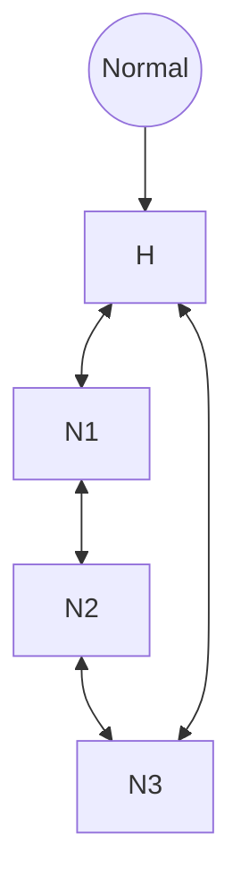
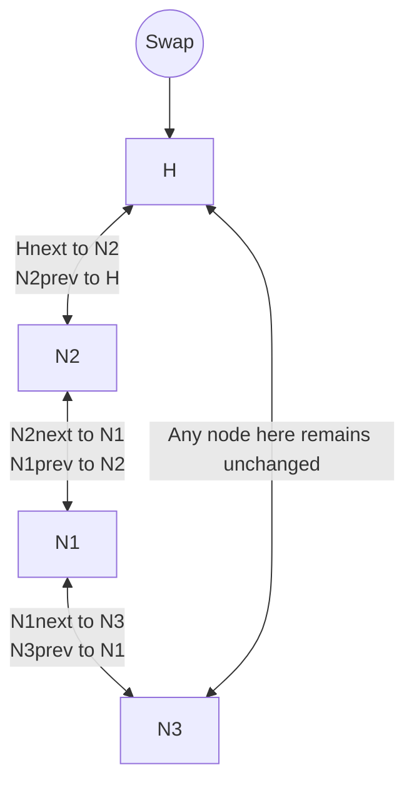

```mermaid
graph TD;
A((Normal))-->H
H<-->N1;
N1<-->N2
N2<-->N3
N3<-->H;
```

```mermaid
graph TD;
A((Swap))-->H
H<-->|Hnext to N2\nN2prev to H|N2;
N2<-->|N2next to N1\nN1prev to N2|N1
N1<-->|N1next to N3\nN3prev to N1|N3
N3<-->|Any node here remains unchanged|H;
```
