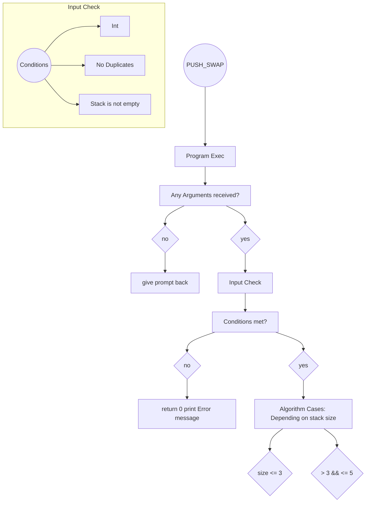

```mermaid
graph TD;
  A((PUSH_SWAP))-->B[Program Exec];
  B-->C[Any Arguments received?];
  C-->C'{yes};
  C-->C''{no};
  C''-->Cf''[give prompt back];
  C'-->D[Input Check];
  D-->D'[Conditions met?];
  D'-->D''{yes};
  D'-->D'''{no};
  D'''-->Df[return 0 print Error message];
  D''-->E[Algorithm Cases: Depending on stack size];
  E-->E'{size <= 3};
  E-->E''{> 3 && <= 5};
  subgraph Input Check
  A1((Conditions))-->B1[Int];
  A1((Conditions))-->C1[No Duplicates];
  A1((Conditions))-->D1[Stack is not empty];
  end
```
